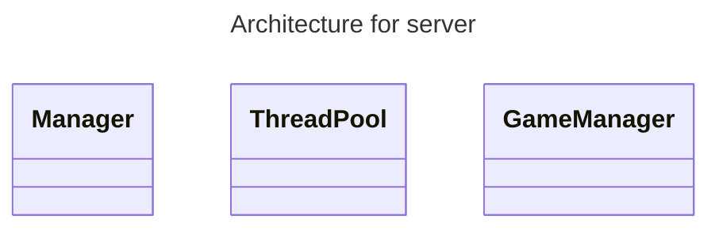

# R-Type - Server
C++ server built with [asio](https://think-async.com/Asio/).

## Project
As the r-type is a game using network, the server is the «heart» of the project. It handles communication between itself and the clients connected, and how the game will evolve.

Its protocol is [udp](https://en.wikipedia.org/wiki/User_Datagram_Protocol), and it uses the library [asio](https://think-async.com/Asio/asio-1.28.0/doc/) to handle the network.

## Thread Pool :white_check_mark:
The server is multithreaded, and uses a [thread pool](https://en.wikipedia.org/wiki/Thread_pool) to handle the commands. By default, the maximum numbers of threads are created, using the function:
```cpp
std::thread::hardware_concurrency()
```
The threads created are waiting until a command is recieved by the server, which will then trigger a [condition variable](https://en.cppreference.com/w/cpp/thread/condition_variable) to allow the thread to select the first command in the queue. When the command is executed, the thread will try to fetch another command, or go back into a waiting mode.\
At the end of the program, the threads are destroyed.

## Protocol :x:
It manage the communication with the client·s. It must be a [binary protocol](https://en.wikipedia.org/wiki/Communication_protocol#Binary).\
For that, the client and server use the same `structure` that is given in the RType-Utils folder, and look like this:
```cpp
#pragma pack(push, 1)

    struct Communication {
        public:
            NetworkType type{None};
            std::array<char, MAX_SIZE> args;
    };

#pragma pack(pop)
```
The `#pragma pack` is used to avoid buffering problems.

## Architecture

