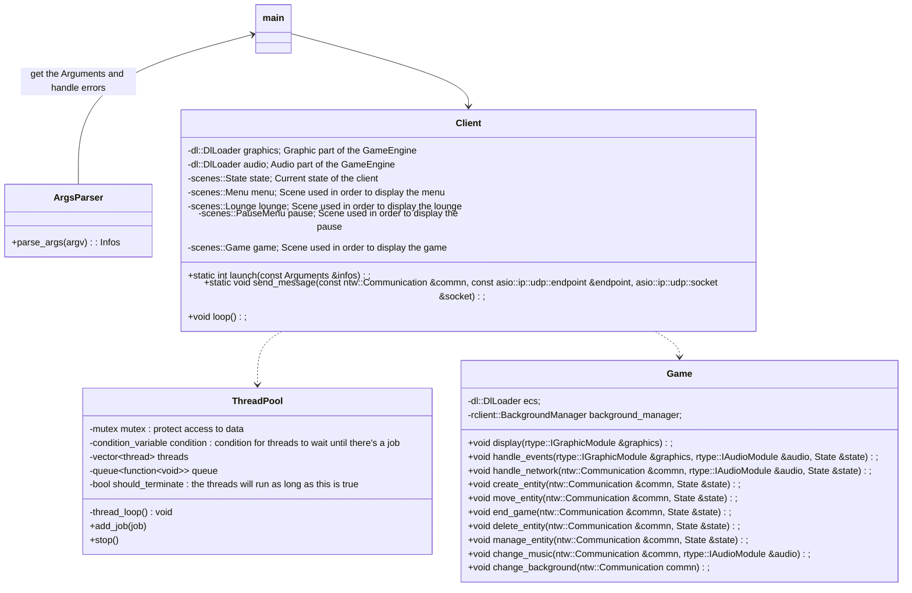

# R-Type - Architecture
Diagrams to show each one of the projects' architecture, whith their classes, ... 

## Server

## RType-Utils

### DlLoader

### Network

## Client

## ECS (Entity Component System)

